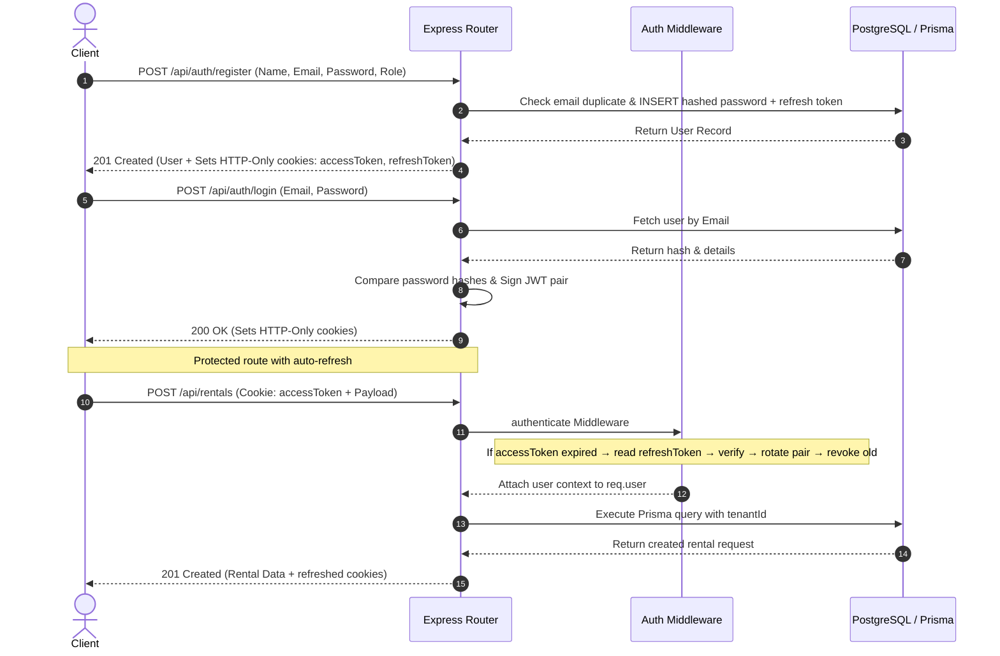
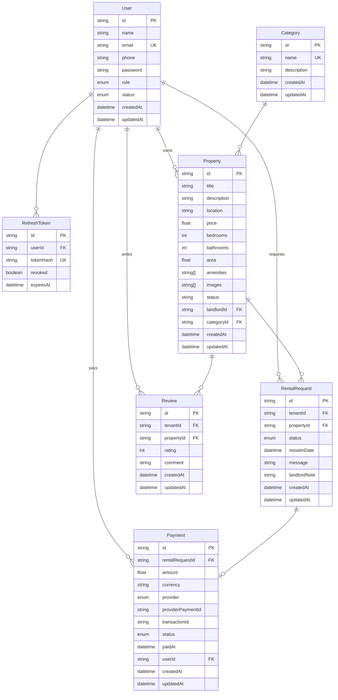

# 🏡 RentNest API

Property Rental Marketplace Platform — a REST API connecting tenants, landlords, and admins for seamless property rental management.

[](https://nodejs.org/)
[](https://www.typescriptlang.org/)
[](https://expressjs.com/)
[](https://www.postgresql.org/)
[](https://www.prisma.io/)
[](https://zod.dev/)
[](https://jwt.io/)
[](https://stripe.com/)
[](https://opensource.org/licenses/ISC)

---

## 🚀 Live Demo

🌐 [Live API Deployment URL](https://rentnest-api.vercel.app/api/properties) _(Update with your active deployment)_

---

## 🛠️ Technology Stack & Core Design

- **Runtime**: **Node.js (LTS v24+)** for non-blocking asynchronous execution.
- **Language**: **TypeScript** for static type-safety and clean compilation.
- **Web Framework**: **Express.js (v5.2+)** utilizing modular router-controller-service architecture.
- **Database Engine**: **PostgreSQL** for relational integrity.
- **ORM**: **Prisma** with `@prisma/adapter-pg` for type-safe database access and auto-generated migrations.
- **Validation**: **Zod** schemas enforcing strict request body validation at the controller layer.
- **Security & Authentication**: **bcryptjs** (10 salt rounds) for password hashing, **JWT token rotation** pattern with HTTP-Only cookies — access tokens auto-refresh via refresh token rotation.
- **Payments**: **Stripe** & **SSLCommerz** support with webhook handling for asynchronous payment confirmation.
- **File Uploads**: **Multer** with automatic type-based sorting into `img/`, `video/`, `audio/`, `pdf/`, `csv/`, `others/` subdirectories.

---

## 👥 Role-Based Access Control (RBAC) Matrix

RentNest enforces strict RBAC at the controller and route layer:

| Capability                         |  Public  |   Tenant   |  Landlord  |    Admin   |
| :--------------------------------- | :------: | :--------: | :--------: | :--------: |
| **Register & Login**               |    ✔️    |     ✔️     |     ✔️     |     ✔️     |
| **Browse / Search Properties**     |    ✔️    |     ✔️     |     ✔️     |     ✔️     |
| **View Property Details**          |    ✔️    |     ✔️     |     ✔️     |     ✔️     |
| **View Categories**                |    ✔️    |     ✔️     |     ✔️     |     ✔️     |
| **Create Property**                |    ❌    |     ❌     |     ✔️     |     ✔️     |
| **Update Own Property**            |    ❌    |     ❌     |     ✔️     |     ✔️     |
| **Delete Own Property**            |    ❌    |     ❌     |     ✔️     |     ✔️     |
| **Submit Rental Request**          |    ❌    |     ✔️     |     ❌     |     ✔️     |
| **Approve / Reject Requests**      |    ❌    |     ❌     |     ✔️     |     ✔️     |
| **Make Payment**                   |    ❌    |     ✔️     |     ❌     |     ✔️     |
| **Leave Review**                   |    ❌    |     ✔️     |     ❌     |     ❌     |
| **Manage Categories**              |    ❌    |     ❌     |     ❌     |     ✔️     |
| **Manage Users (Ban/Activate)**    |    ❌    |     ❌     |     ❌     |     ✔️     |
| **View All Properties/Rentals**    |    ❌    |     ❌     |     ❌     |     ✔️     |

---

## 🔐 Authentication & Authorization Flow

RentNest uses **JWT token rotation**: on each refresh, the old refresh token is revoked and a new pair is issued, limiting the exposure window of compromised tokens.



---

## 🗄️ Database Schema & Index Design


### 🗄️ ERD Design
🌐 [Live ERD URL](https://lucid.app/lucidchart/986ac4d3-9974-4d25-84a9-c265e86f3820/edit?viewport_loc=-1070%2C-2576%2C2911%2C1381%2C0_0&invitationId=inv_fa7adaa5-6988-4133-872b-b478fa452567)


The database consists of **6 models** managed through **Prisma** with automated migrations.



### 1. `users` Table

Stores registered users with role constraints (`tenant`, `landlord`, `admin`).

| Column      | Data Type       | Constraints                           | Default            |
| :---------- | :-------------- | :------------------------------------ | :----------------- |
| `id`        | `UUID (String)` | `PRIMARY KEY`                         | `uuid()`           |
| `name`      | `String`        | `NOT NULL`                            | -                  |
| `email`     | `String`        | `UNIQUE`, `NOT NULL`                  | -                  |
| `phone`     | `String?`       | -                                     | -                  |
| `password`  | `String`        | `NOT NULL` (bcrypt-hashed)            | -                  |
| `role`      | `Role` (enum)   | `tenant` / `landlord` / `admin`       | `tenant`           |
| `status`    | `UserStatus`    | `active` / `banned`                   | `active`           |
| `createdAt` | `DateTime`      | -                                     | `now()`            |
| `updatedAt` | `DateTime`      | -                                     | `@updatedAt`       |

### 2. `refresh_tokens` Table

Stores JWT refresh tokens for secure session rotation.

| Column      | Data Type       | Constraints                           | Default            |
| :---------- | :-------------- | :------------------------------------ | :----------------- |
| `id`        | `UUID (String)` | `PRIMARY KEY`                         | `uuid()`           |
| `userId`    | `UUID (String)` | `FK -> users.id (CASCADE)`            | -                  |
| `tokenHash` | `String`        | `UNIQUE`, `NOT NULL`                  | -                  |
| `revoked`   | `Boolean`       | -                                     | `false`            |
| `expiresAt` | `DateTime`      | `NOT NULL`                            | -                  |
| `createdAt` | `DateTime`      | -                                     | `now()`            |

### 3. `categories` Table

Property categories (e.g., Apartment, Villa, Office Space).

| Column        | Data Type       | Constraints                           | Default            |
| :------------ | :-------------- | :------------------------------------ | :----------------- |
| `id`          | `UUID (String)` | `PRIMARY KEY`                         | `uuid()`           |
| `name`        | `String`        | `UNIQUE`, `NOT NULL`                  | -                  |
| `description` | `String?`       | -                                     | -                  |
| `createdAt`   | `DateTime`      | -                                     | `now()`            |
| `updatedAt`   | `DateTime`      | -                                     | `@updatedAt`       |

### 4. `properties` Table

Core rental listings posted by landlords.

| Column        | Data Type        | Constraints                              | Default         |
| :------------ | :--------------- | :--------------------------------------- | :-------------- |
| `id`          | `UUID (String)`  | `PRIMARY KEY`                            | `uuid()`        |
| `title`       | `String`         | `NOT NULL`                               | -               |
| `description` | `String`         | `NOT NULL`                               | -               |
| `location`    | `String`         | `NOT NULL`                               | -               |
| `price`       | `Float`          | `NOT NULL`                               | -               |
| `bedrooms`    | `Int?`           | -                                        | -               |
| `bathrooms`   | `Int?`           | -                                        | -               |
| `area`        | `Float?`         | -                                        | -               |
| `amenities`   | `String[]`       | -                                        | -               |
| `images`      | `String[]`       | -                                        | -               |
| `status`      | `String`         | -                                        | `"available"`   |
| `landlordId`  | `UUID (String)`  | `FK -> users.id (CASCADE)`               | -               |
| `categoryId`  | `UUID (String)`  | `FK -> categories.id (RESTRICT)`         | -               |
| `createdAt`   | `DateTime`       | -                                        | `now()`         |
| `updatedAt`   | `DateTime`       | -                                        | `@updatedAt`    |

### 5. `rental_requests` Table

Tracks rental lifecycle from request to completion.

| Column        | Data Type          | Constraints                              | Default         |
| :------------ | :----------------- | :--------------------------------------- | :-------------- |
| `id`          | `UUID (String)`    | `PRIMARY KEY`                            | `uuid()`        |
| `tenantId`    | `UUID (String)`    | `FK -> users.id (CASCADE)`               | -               |
| `propertyId`  | `UUID (String)`    | `FK -> properties.id (CASCADE)`          | -               |
| `status`      | `RentalStatus`     | `pending` / `approved` / `rejected` / `active` / `completed` / `cancelled` | `pending` |
| `moveInDate`  | `DateTime?`        | -                                        | -               |
| `message`     | `String?`          | Tenant's note to landlord                | -               |
| `landlordNote`| `String?`          | Landlord's reply                         | -               |
| `createdAt`   | `DateTime`         | -                                        | `now()`         |
| `updatedAt`   | `DateTime`         | -                                        | `@updatedAt`    |

### 6. `payments` Table

Payment records linked to rental requests (Stripe or SSLCommerz).

| Column             | Data Type          | Constraints                              | Default         |
| :----------------- | :----------------- | :--------------------------------------- | :-------------- |
| `id`               | `UUID (String)`    | `PRIMARY KEY`                            | `uuid()`        |
| `rentalRequestId`  | `UUID (String)`    | `UNIQUE`, `FK -> rental_requests.id (CASCADE)` | -          |
| `amount`           | `Float`            | `NOT NULL`                               | -               |
| `currency`         | `String`           | -                                        | `"usd"`         |
| `provider`         | `PaymentProvider`  | `stripe` / `sslcommerz`                  | -               |
| `providerPaymentId`| `String?`          | Stripe payment intent ID                 | -               |
| `transactionId`    | `String?`          | -                                        | -               |
| `status`           | `PaymentStatus`    | `pending` / `completed` / `failed` / `refunded` | `pending` |
| `paidAt`           | `DateTime?`        | -                                        | -               |
| `userId`           | `UUID (String)`    | `FK -> users.id (CASCADE)`               | -               |
| `createdAt`        | `DateTime`         | -                                        | `now()`         |
| `updatedAt`        | `DateTime`         | -                                        | `@updatedAt`    |

### 7. `reviews` Table

Post-rental reviews — one review per tenant per property enforced by a composite unique constraint.

| Column       | Data Type          | Constraints                              | Default         |
| :----------- | :----------------- | :--------------------------------------- | :-------------- |
| `id`         | `UUID (String)`    | `PRIMARY KEY`                            | `uuid()`        |
| `tenantId`   | `UUID (String)`    | `FK -> users.id (CASCADE)`               | -               |
| `propertyId` | `UUID (String)`    | `FK -> properties.id (CASCADE)`          | -               |
| `rating`     | `Int`              | `NOT NULL` (1-5)                         | -               |
| `comment`    | `String?`          | -                                        | -               |
| `createdAt`  | `DateTime`         | -                                        | `now()`         |
| `updatedAt`  | `DateTime`         | -                                        | `@updatedAt`    |
|              |                    | `@@unique([tenantId, propertyId])`       |                 |

---

## 🔗 API Documentation & Usage Contract

All API responses follow a strict schema signature:

```json
{
  "statusCode": 200,
  "success": true,
  "message": "...",
  "data": { ... }
}
```

Error responses replace `data` with an `errors` field containing validation or error details.

---

### 🔹 Authentication Module

#### 1. Register Account

- **Endpoint**: `POST /api/auth/register`
- **Access**: Public
- **Request Body**:
  ```json
  {
    "name": "John Doe",
    "email": "john@example.com",
    "password": "SecurePass123!",
    "role": "tenant",
    "phone": "+8801700000000"
  }
  ```
- **Cookies Set**: `accessToken` (15min), `refreshToken` (7d) — HTTP-Only, Secure, SameSite=Strict
- **Success Response (201 Created)**:
  ```json
  {
    "statusCode": 201,
    "success": true,
    "message": "User registered successfully",
    "data": {
      "user": {
        "id": "uuid-here",
        "name": "John Doe",
        "email": "john@example.com",
        "role": "tenant",
        "phone": "+8801700000000",
        "status": "active",
        "createdAt": "2026-07-25T10:00:00.000Z",
        "updatedAt": "2026-07-25T10:00:00.000Z"
      }
    }
  }
  ```

#### 2. Login

- **Endpoint**: `POST /api/auth/login`
- **Access**: Public
- **Request Body**:
  ```json
  {
    "email": "john@example.com",
    "password": "SecurePass123!"
  }
  ```
- **Success Response (200 OK)**:
  ```json
  {
    "statusCode": 200,
    "success": true,
    "message": "Login successful",
    "data": {
      "user": {
        "id": "uuid-here",
        "name": "John Doe",
        "email": "john@example.com",
        "role": "tenant",
        "status": "active",
        "createdAt": "2026-07-25T10:00:00.000Z",
        "updatedAt": "2026-07-25T10:00:00.000Z"
      }
    }
  }
  ```

#### 3. Refresh Tokens

- **Endpoint**: `POST /api/auth/refresh`
- **Access**: Public (requires `refreshToken` cookie)
- **Behavior**: Revokes old refresh token, issues a new JWT pair
- **Success Response (200 OK)**: Resets cookies; returns `{ accessToken }`

#### 4. Logout

- **Endpoint**: `POST /api/auth/logout`
- **Access**: Public (requires `refreshToken` cookie)
- **Behavior**: Revokes the refresh token in the database, clears cookies
- **Success Response (200 OK)**: `{ "data": null }`

#### 5. Get Current User Profile

- **Endpoint**: `GET /api/auth/me`
- **Access**: Authenticated (any role)
- **Success Response (200 OK)**: Returns user object

---

### 🔹 Properties Module

#### 6. List / Search Properties

- **Endpoint**: `GET /api/properties`
- **Access**: Public
- **Query Parameters**:
  - `search` (string, optional): Search by title or description
  - `location` (string, optional): Filter by location
  - `minPrice` / `maxPrice` (number, optional): Price range filter
  - `categoryId` (UUID, optional): Filter by category
  - `status` (string, optional): Filter by property status (`available`, `rented`)
  - `page` (number, default: 1): Pagination
  - `limit` (number, default: 10): Items per page
- **Success Response (200 OK)**:
  ```json
  {
    "statusCode": 200,
    "success": true,
    "message": "Properties retrieved successfully",
    "data": {
      "properties": [
        {
          "id": "uuid",
          "title": "Luxury Apartment in Gulshan",
          "description": "A beautiful 3-bedroom apartment...",
          "location": "Gulshan, Dhaka",
          "price": 25000,
          "bedrooms": 3,
          "bathrooms": 2,
          "area": 1500,
          "amenities": ["wifi", "parking", "gym"],
          "images": ["uploads/img/property1.jpg"],
          "status": "available",
          "category": { "id": "uuid", "name": "Apartment" },
          "landlord": { "id": "uuid", "name": "Jane Landlord" },
          "createdAt": "2026-07-25T10:00:00.000Z",
          "updatedAt": "2026-07-25T10:00:00.000Z"
        }
      ],
      "total": 1,
      "page": 1,
      "limit": 10
    }
  }
  ```

#### 7. Get Single Property

- **Endpoint**: `GET /api/properties/:id`
- **Access**: Public
- **Success Response (200 OK)**: Returns property with category, landlord, and reviews

#### 8. Create Property

- **Endpoint**: `POST /api/properties`
- **Access**: `landlord`, `admin`
- **Request Body**:
  ```json
  {
    "title": "Luxury Apartment in Gulshan",
    "description": "A beautiful 3-bedroom apartment with sea view.",
    "location": "Gulshan, Dhaka",
    "price": 25000,
    "bedrooms": 3,
    "bathrooms": 2,
    "area": 1500,
    "amenities": ["wifi", "parking", "gym"],
    "images": ["uploads/img/property1.jpg"],
    "categoryId": "uuid-category-id"
  }
  ```
- **Success Response (201 Created)**: Returns created property

#### 9. Update Property

- **Endpoint**: `PUT /api/properties/:id`
- **Access**: `landlord` (own only), `admin`
- **Request Body**: Partial fields of create
- **Success Response (200 OK)**: Returns updated property

#### 10. Delete Property

- **Endpoint**: `DELETE /api/properties/:id`
- **Access**: `landlord` (own only), `admin`
- **Success Response (200 OK)**: `{ "data": null }`

#### 11. Get Property Reviews

- **Endpoint**: `GET /api/properties/:propertyId/reviews`
- **Access**: Public
- **Success Response (200 OK)**: Returns reviews array

---

### 🔹 Landlord Management Module

#### 12. List Landlord's Properties

- **Endpoint**: `GET /api/landlord/properties`
- **Access**: `landlord`, `admin`
- **Success Response (200 OK)**: Returns array of own properties

#### 13. Create Property (Landlord Route)

- **Endpoint**: `POST /api/landlord/properties`
- **Access**: `landlord`, `admin`
- **Request Body**: Same as `POST /api/properties`

#### 14. Update Property (Landlord Route)

- **Endpoint**: `PUT /api/landlord/properties/:id`
- **Access**: `landlord` (own only), `admin`

#### 15. Delete Property (Landlord Route)

- **Endpoint**: `DELETE /api/landlord/properties/:id`
- **Access**: `landlord` (own only), `admin`

#### 16. List Rental Requests (for Landlord)

- **Endpoint**: `GET /api/landlord/requests`
- **Access**: `landlord`, `admin`
- **Success Response (200 OK)**: Returns all rental requests for landlord's properties

#### 17. Approve / Reject Rental Request

- **Endpoint**: `PATCH /api/landlord/requests/:id`
- **Access**: `landlord` (own property), `admin`
- **Request Body**:
  ```json
  {
    "status": "approved",
    "landlordNote": "Welcome! You can move in on August 1st."
  }
  ```
- **Behavior**: Approving sets property status to `"rented"`, rejecting keeps it `"available"`
- **Success Response (200 OK)**: Returns updated rental request

---

### 🔹 Rentals Module

#### 18. Submit Rental Request

- **Endpoint**: `POST /api/rentals`
- **Access**: `tenant`, `admin`
- **Request Body**:
  ```json
  {
    "propertyId": "uuid-property-id",
    "moveInDate": "2026-09-01T00:00:00.000Z",
    "message": "I am interested in this property. Please contact me."
  }
  ```
- **Success Response (201 Created)**:
  ```json
  {
    "statusCode": 201,
    "success": true,
    "message": "Rental request submitted successfully",
    "data": {
      "id": "uuid-rental-id",
      "status": "pending",
      "moveInDate": "2026-09-01T00:00:00.000Z",
      "message": "I am interested in this property.",
      "tenantId": "uuid-tenant-id",
      "propertyId": "uuid-property-id",
      "createdAt": "2026-07-25T10:00:00.000Z",
      "updatedAt": "2026-07-25T10:00:00.000Z"
    }
  }
  ```

#### 19. Get User's Rentals

- **Endpoint**: `GET /api/rentals`
- **Access**: Authenticated (tenants see own; landlords see requests on their properties)
- **Success Response (200 OK)**: Returns array of rental requests

#### 20. Get Single Rental Request

- **Endpoint**: `GET /api/rentals/:id`
- **Access**: Authenticated (owner or related landlord/admin)

---

### 🔹 Payments Module

#### 21. Create Payment Intent

- **Endpoint**: `POST /api/payments/create`
- **Access**: `tenant`, `admin`
- **Request Body**:
  ```json
  {
    "rentalRequestId": "uuid-rental-request-id",
    "provider": "stripe"
  }
  ```
- **Success Response (201 Created)**:
  ```json
  {
    "statusCode": 201,
    "success": true,
    "message": "Payment initiated successfully",
    "data": {
      "payment": { "id": "uuid", "amount": 25000, "provider": "stripe", "status": "pending" },
      "clientSecret": "pi_xxx_secret_xxx"
    }
  }
  ```

#### 22. Confirm Payment

- **Endpoint**: `POST /api/payments/confirm`
- **Access**: `tenant`, `admin`
- **Request Body**:
  ```json
  {
    "paymentId": "uuid-payment-id",
    "transactionId": "txn_12345"
  }
  ```
- **Behavior**: Sets payment to `completed`, rental request to `active`
- **Success Response (200 OK)**: Returns updated payment

#### 23. Get User's Payments

- **Endpoint**: `GET /api/payments`
- **Access**: `tenant`, `admin`
- **Success Response (200 OK)**: Returns array of payments

#### 24. Get Single Payment

- **Endpoint**: `GET /api/payments/:id`
- **Access**: `tenant` (own), `admin`

#### 25. Stripe Webhook

- **Endpoint**: `POST /api/payments/webhook`
- **Access**: Public (Stripe-signed)
- **Body**: Raw `application/json` with `stripe-signature` header
- **Behavior**: Receives raw body (bypasses JSON parser) to validate Stripe webhook events

---

### 🔹 Reviews Module

#### 26. Create Review

- **Endpoint**: `POST /api/reviews`
- **Access**: `tenant` (only after an active/completed rental on that property)
- **Request Body**:
  ```json
  {
    "propertyId": "uuid-property-id",
    "rating": 5,
    "comment": "Amazing place! The landlord was very helpful."
  }
  ```
- **Success Response (201 Created)**:
  ```json
  {
    "statusCode": 201,
    "success": true,
    "message": "Review submitted successfully",
    "data": {
      "id": "uuid-review-id",
      "rating": 5,
      "comment": "Amazing place!",
      "tenantId": "uuid-tenant-id",
      "propertyId": "uuid-property-id",
      "createdAt": "2026-07-25T10:00:00.000Z"
    }
  }
  ```

---

### 🔹 Categories Module

#### 27. List Categories

- **Endpoint**: `GET /api/categories`
- **Access**: Public
- **Success Response (200 OK)**:
  ```json
  {
    "statusCode": 200,
    "success": true,
    "message": "Categories retrieved successfully",
    "data": [
      {
        "id": "uuid",
        "name": "Apartment",
        "description": "Residential apartment units",
        "_count": { "properties": 12 }
      }
    ]
  }
  ```

---

### 🔹 Admin Module

#### 28. List All Users

- **Endpoint**: `GET /api/admin/users`
- **Access**: `admin`
- **Query**: `page`, `limit`
- **Success**: Paginated users list with totals

#### 29. Update User Status

- **Endpoint**: `PATCH /api/admin/users/:id`
- **Access**: `admin`
- **Request Body**:
  ```json
  { "status": "banned" }
  ```
- **Success Response (200 OK)**: Returns updated user

#### 30. List All Properties (Admin)

- **Endpoint**: `GET /api/admin/properties`
- **Access**: `admin`
- **Query**: `page`, `limit`

#### 31. List All Rentals (Admin)

- **Endpoint**: `GET /api/admin/rentals`
- **Access**: `admin`
- **Query**: `page`, `limit`

#### 32. Create Category

- **Endpoint**: `POST /api/admin/categories`
- **Access**: `admin`
- **Request Body**:
  ```json
  { "name": "Villa", "description": "Luxury standalone villas" }
  ```
- **Success Response (201 Created)**: Returns created category

#### 33. Update Category

- **Endpoint**: `PUT /api/admin/categories/:id`
- **Access**: `admin`
- **Request Body**: `{ "name": "...", "description": "..." }`

#### 34. Delete Category

- **Endpoint**: `DELETE /api/admin/categories/:id`
- **Access**: `admin`
- **Success Response (200 OK)**: `{ "data": null }`

---

## 📁 Project Architecture & Directory Layout

```
B7A4_LEVEL2/
├── prisma/
│   ├── schema/                   # Prisma schema files
│   │   ├── datasource.prisma     # DB provider & generator config
│   │   ├── user.prisma           # User + RefreshToken models
│   │   └── rental.prisma         # Category, Property, RentalRequest, Payment, Review
│   ├── migrations/               # Auto-generated migration history
│   ├── seed.ts                   # Minimal seed (admin + 5 categories)
│   └── big_data_seed.ts          # Comprehensive demo seed data
├── src/
│   ├── config/
│   │   ├── env.ts                # Typed environment variable loader
│   │   └── http_status.ts        # HTTP status code constants
│   ├── controllers/
│   │   ├── auth.controller.ts    # Auth: register, login, refresh, logout, profile
│   │   ├── property.controller.ts # Property CRUD + search/listing
│   │   ├── rental.controller.ts  # Rental requests CRUD
│   │   ├── payment.controller.ts # Payment intent, confirm, webhook
│   │   ├── review.controller.ts  # Reviews creation & retrieval
│   │   ├── category.controller.ts # Category listing
│   │   └── admin.controller.ts   # Admin: users, properties, rentals, categories
│   ├── middlewares/
│   │   ├── auth.middleware.ts    # JWT extraction, auto-refresh via rotation
│   │   ├── role.middleware.ts    # authorize(...roles) RBAC guard
│   │   ├── error.middleware.ts   # Global error handler (Zod, JWT, etc.)
│   │   └── media.middleware.ts   # Multer upload with type-based sorting
│   ├── routes/
│   │   ├── auth.routes.ts        # /api/auth/*
│   │   ├── property.routes.ts    # /api/properties/*
│   │   ├── landlord.routes.ts    # /api/landlord/*
│   │   ├── rental.routes.ts      # /api/rentals/*
│   │   ├── payment.routes.ts     # /api/payments/*
│   │   ├── review.routes.ts      # /api/reviews/*
│   │   ├── category.routes.ts    # /api/categories/*
│   │   ├── user.routes.ts        # /api/user/*
│   │   └── admin.routes.ts       # /api/admin/*
│   ├── services/
│   │   ├── auth.service.ts       # User DB operations, bcrypt hashing
│   │   ├── token.service.ts      # JWT issue, verify, rotate
│   │   ├── property.service.ts   # Property CRUD with filtering & pagination
│   │   ├── rental.service.ts     # Rental request management
│   │   ├── payment.service.ts    # Payment record management
│   │   ├── review.service.ts     # Review creation & query
│   │   └── category.service.ts   # Category CRUD with property count
│   ├── validators/
│   │   ├── auth.validator.ts     # Zod schemas for signup & login
│   │   ├── property.validator.ts # Zod schemas for create/update property
│   │   ├── rental.validator.ts   # Zod schemas for rental request & status update
│   │   ├── payment.validator.ts  # Zod schemas for payment create & confirm
│   │   ├── review.validator.ts   # Zod schema for review creation
│   │   └── category.validator.ts # Zod schemas for category create/update
│   ├── prisma/
│   │   └── client.ts             # PrismaClient singleton with adapter-pg
│   ├── types/
│   │   ├── jwt-payload.d.ts      # JWT payload type definitions
│   │   └── express.d.ts          # Express Request augmentation
│   └── utils/
│       ├── jwt.util.ts           # Token signing & verification helpers
│       ├── hash.util.ts          # bcrypt hash & compare helpers
│       └── apiResponse.util.ts   # Standardized JSON response formatters
├── .env                          # Development environment variables
├── .env.production               # Production environment variables
├── prisma.config.ts              # Prisma CLI configuration
├── tsconfig.json                 # TypeScript compiler config
├── tsconfig.prod.json            # Production build config
└── package.json                  # Dependencies & scripts
```

---

## ⚙️ Environment Variables Settings

Copy the `.env` file from the template or create it manually:

```env
NODE_ENV=development
PORT=5000

# PostgreSQL connection string (Supabase, NeonDB, or local)
DATABASE_URL="postgresql://<user>:<password>@<host>:<port>/<db>?sslmode=require"

# JWT secrets (use strong base64-encoded keys)
JWT_ACCESS_SECRET="your_base64_access_secret"
JWT_REFRESH_SECRET="your_base64_refresh_secret"
JWT_ACCESS_EXPIRY=15m
JWT_REFRESH_EXPIRY=7d

# Bcrypt cost factor
BCRYPT_SALT_ROUNDS=10

# Cookie max ages (milliseconds)
ACCESS_TOKEN_MAX_AGE=900000        # 15 minutes
REFRESH_TOKEN_MAX_AGE=604800000   # 7 days

# CORS allowed origin (frontend URL)
SITE_URL="http://localhost:5173"

# Body size limits
URL_FILE_SIZE=25mb
MULTER_FILE_SIZE=45               # MB

# Stripe (optional — falls back to mock if absent)
STRIPE_SECRET_KEY="sk_test_..."
STRIPE_WEBHOOK_SECRET="whsec_..."
```

---

## 🔧 Installation & Execution Instructions

### 1. Prerequisites

- **Node.js**: `v24` or higher (`node -v`)
- **PostgreSQL**: Access to a clean database (local or cloud-hosted)

### 2. Clone & Setup Environment

```bash
git clone <https://github.com/Fahim-rafi24/B7A4_LEVEL2.git>
cd B7A4_LEVEL2

# Create .env file (see Environment Variables above)
```

### 3. Install Dependencies

```bash
npm install
```

### 4. Initialize Database

```bash
# Generate Prisma client & run migrations
npx prisma generate
npx prisma db push

# Seed with sample data (minimal)
npm run seed

# Or seed with comprehensive demo data
npm run big-data-seed
```

### 5. Development Run

```bash
npm run dev
```

Server starts at `http://localhost:5000` with hot-reload via `tsx watch`.

### 6. Production Build

```bash
npm run build        # Generates Prisma client + compiles TypeScript
npm start            # Runs compiled JS from /dist
```

---

## 🧪 Testing & API Validation

Use **Postman**, **Insomnia**, or **cURL** to interact with the API.

For authenticated routes, ensure cookie support is enabled. The API uses HTTP-Only cookies — the `accessToken` cookie is automatically set on login/register and sent on subsequent requests.

### Available Seed Data

| Command | Description |
|---------|-------------|
| `npm run seed` | Creates 1 admin user + 5 categories |
| `npm run big-data-seed` | Creates 1 admin, 4 landlords, 3 tenants, 5 categories, 22 properties + sample rental/payment/review |

### Default Seed Credentials

```
Admin:     admin@rentnest.com / Admin@123
Landlord:  landlord1@example.com / Landlord@123
Tenant:    tenant1@example.com / Tenant@123
```

### HTTP Status Code Reference

| Code | Description |
|------|-------------|
| `200` OK | Success on fetches, updates, deletes |
| `201` Created | Resource successfully created |
| `400` Bad Request | Zod validation errors, malformed input |
| `401` Unauthorized | Missing/expired/invalid JWT |
| `403` Forbidden | Role not authorized for the action |
| `404` Not Found | Resource does not exist |
| `409` Conflict | Duplicate email or constraint violation |
| `500` Internal Server Error | Unexpected server failure |

---

## 🌟 Key Features

- **JWT Token Rotation** — Refresh tokens are revoked and rotated on each use, minimizing the impact of token theft
- **Prisma ORM** — Type-safe database access with auto-generated migrations and full TypeScript intellisense
- **Zod Validation** — Strict request validation at the controller layer with descriptive error messages
- **Dual Payment Providers** — Stripe integration with webhook support + SSLCommerz for regional payments
- **Smart File Uploads** — Multer middleware automatically sorts uploads into type-based directories
- **Advanced Search & Filtering** — Properties can be searched by keyword, location, price range, category, and status with pagination
- **Comprehensive RBAC** — Three-tier role system (tenant, landlord, admin) with ownership-based access control
- **Stripe Mock Fallback** — Development mode works without Stripe credentials by falling back to mock payments

---

_Built with care as part of B7A4 Level 2 Assignment._
